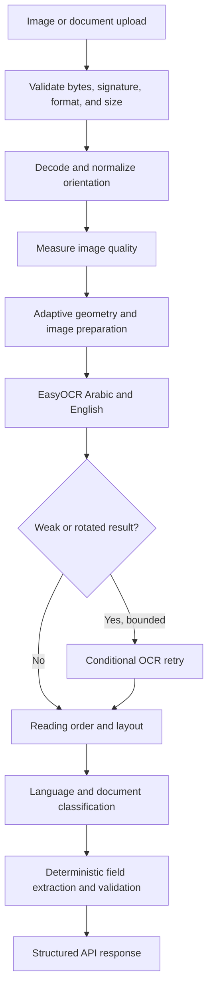

# OmniOCR

Offline Arabic and English OCR with a FastAPI API and an optional Gradio interface. The service uses EasyOCR for text recognition and Python-based processing for layout analysis, document classification, and structured field extraction.

> OCR is probabilistic. Review low-confidence output and verify names, dates, amounts, and identifiers against the source document before using them in a decision or transaction.

## Features

- Local EasyOCR inference for Arabic and English; no hosted OCR or LLM API is called by the application.
- Adaptive image preparation, bounded low-confidence/orientation retries, and confidence indicators.
- RTL/LTR reading-order reconstruction for Arabic text mixed with English and numbers.
- Heuristic classification and field extraction for common IDs, invoices, receipts, contracts, CVs, passports, driving licenses, and bank documents.
- Single-image OCR and multi-page PDF/TIFF processing.
- FastAPI endpoints with OpenAPI docs and a browser viewer; optional Gradio upload interface.
- Upload, page-count, image-dimension, and rendered-pixel limits.

EasyOCR weights are stored locally under `MODEL_DIR`. The first run may need internet access to download missing model weights. After the required weights are present, recognition runs locally.

## Architecture



OCR orchestration is implemented as a bounded Python pipeline with conditional routing in `app/services/ocr/passes.py`; the application does not use LangGraph or call an LLM. The conditional retry is intended for weak or orientation-suspect OCR results, not every upload.

## Requirements

- Python 3.10 or newer (Docker uses Python 3.11).
- CPU and memory for PyTorch/EasyOCR inference. The model and image size affect latency and memory use.
- EasyOCR model weights. The application downloads missing weights on first initialization unless they are already in `MODEL_DIR`.

## Quick start

### 1. Create an environment and install dependencies

```bash
git clone <repository-url>
cd <repository-directory>
python -m venv .venv
```

Activate the environment:

```powershell
# Windows PowerShell
.\.venv\Scripts\Activate.ps1
```

```bash
# Linux or macOS
source .venv/bin/activate
```

Install dependencies:

```bash
python -m pip install --upgrade pip
python -m pip install -r requirements-dev.txt
```

### 2. Configure the service

Copy `.env.example` to `.env` and adjust values for the machine if needed. Configuration is loaded from environment variables or `.env`; defaults are defined in `app/core/config.py`.

### 3. Start the API

```bash
uvicorn app.main:app --host 127.0.0.1 --port 8000
```

- Swagger UI: <http://127.0.0.1:8000/docs>
- OpenAPI schema: <http://127.0.0.1:8000/openapi.json>
- Document viewer: <http://127.0.0.1:8000/viewer>
- Health: <http://127.0.0.1:8000/health>

To start the Gradio interface with the API routes attached:

```bash
python app.py
```

The Gradio interface uses port `7860` by default. Set `PORT` to change it.

### Docker

The Docker image runs the FastAPI service (including `/viewer`) on port `7860` inside the container. From the repository root:

```bash
docker compose up --build
```

The compose file publishes it at <http://127.0.0.1:8000>. The image build preloads EasyOCR weights, so its first build requires access to the model host and produces a larger image than a source-only API.

When deploying behind a reverse proxy, set the Docker-only `FORWARDED_ALLOW_IPS` variable to the trusted proxy IP addresses or CIDRs. Do not use `*` on a public deployment.

## API

### `POST /ocr/extract`

Processes one raster image. Send a multipart form field named `file`.

Supported detected image formats: JPEG, PNG, WebP, BMP, and TIFF. This endpoint accepts a single-frame image; use `/ocr/document` for multi-page files.

```bash
curl -X POST http://127.0.0.1:8000/ocr/extract \
  -H "accept: application/json" \
  -F "file=@document.jpg"
```

### `POST /ocr/document`

Processes all pages in a PDF or multi-frame TIFF, and can also process supported raster images. Limits are configured by `MAX_UPLOAD_SIZE_MB` and `DOCUMENT_MAX_PAGES`; rendered PDF pages are bounded by the image-processing limits.

```bash
curl -X POST http://127.0.0.1:8000/ocr/document \
  -H "accept: application/json" \
  -F "file=@document.pdf"
```

### `GET /health`

Returns service status, version, and whether the EasyOCR engine has been initialized. A healthy HTTP response does not guarantee that optional model weights were loaded successfully; check the service logs if OCR initialization fails.

## Response data

The image endpoint returns an `OCRResponse`. Key properties include:

| Field | Meaning |
|---|---|
| `text` | Layout-ordered OCR text |
| `raw_text` | OCR transcription before normalized output is assembled |
| `normalized_text` | Text with whitespace and Unicode-space normalization; it is not a language-model rewrite |
| `confidence` | Mean EasyOCR detection confidence, from `0` to `1` |
| `needs_review` | Whether the result is empty or contains low-confidence lines |
| `uncertain_lines` | Line numbers below the configured confidence threshold |
| `fields` | Deterministically extracted fields, when available |
| `structured_fields` | Field values with confidence and validation metadata |
| `quality` | Image quality metrics and preprocessing/retry notes |
| `processing` | Stage timing details |

The document endpoint returns page-level `OCRResponse` objects plus combined text. See `/docs` for the complete schemas. Document-specific field extractors may normalize candidate field values; compare critical fields with `raw_text` and the source image.

## Configuration

| Variable | Default | Description |
|---|---:|---|
| `MODEL_DIR` | `models/easyocr` | Local EasyOCR model directory |
| `CONFIDENCE_THRESHOLD` | `0.5` | Line/detection threshold used to mark results for review |
| `OCR_RETRY_CONFIDENCE` | `0.60` | Confidence threshold that can trigger a bounded retry |
| `OCR_ORIENTATION_CONFIDENCE` | `0.30` | Very-low-confidence threshold for orientation candidates |
| `OCR_CANVAS_SIZE` | `3200` | Maximum EasyOCR inference canvas size |
| `OCR_WIDTH_THRESHOLD` | `0.5` | EasyOCR horizontal text grouping threshold |
| `DOCUMENT_MAX_PAGES` | `20` | Maximum pages/frames per document |
| `DOCUMENT_DPI` | `200` | PDF rendering resolution, subject to pixel limits |
| `MAX_UPLOAD_SIZE_MB` | `10` | Maximum upload size |
| `LOGGING_LEVEL` | `INFO` | Application log level |
| `CORS_ALLOW_ORIGINS` | `[]` | JSON array of permitted browser origins; same-origin access needs no CORS entry |

For a separately hosted frontend, set `CORS_ALLOW_ORIGINS` to a JSON array containing its exact origin, such as `CORS_ALLOW_ORIGINS=["https://ocr.example.com"]`. Credentials are not enabled by the service.

## Run checks

Run the test suite from the repository root:

```bash
python -m pytest -q
```

`requirements-dev.txt` installs the application dependencies and pytest. This command is documented for contributors; no test run is claimed by this README.

The project also includes scripts for evaluating labeled OCR samples:

```bash
python scripts/evaluate_ocr.py --help
python scripts/benchmark_easyocr.py --help
```

Evaluation scores are meaningful only when inputs have reviewed ground-truth text. A small sample or synthetic degradation is not a general accuracy guarantee.

## Repository map

```text
app/
  api/                 FastAPI routes and dependency wiring
  core/                Configuration, logging, and error handling
  domain/              OCR interfaces and response/data schemas
  infrastructure/ocr/  EasyOCR engine adapter
  services/
    image_processing/  Upload decoding, quality checks, and preprocessing
    ocr/               Shared OCR pipeline, retries, and evaluation helpers
    layout/            Reading order, bidi handling, and layout analysis
    classification/    Document type classification
    extraction/        Document-specific field extractors and validators
public/                Browser viewer
scripts/               Evaluation and debugging utilities
tests/                 Unit and regression tests
```

## Evaluation and design notes

- [OCR audit](AUDIT_REPORT.md)
- [OCR fixes](OCR_FIXES.md)
- [OCR evaluation](OCR_EVALUATION.md)
- [Graph/workflow optimization notes](GRAPH_OPTIMIZATION.md)

These reports record prior inspection and evaluation work. Check their dates and stated test environment before treating a result as current.

## Limitations

- Small, blurred, compressed, handwritten, or low-contrast text can be misrecognized. Upscaling cannot restore details absent from the input.
- Confidence is a model score, not a calibrated probability that a word or field is correct.
- Reading order and table detection use geometric heuristics; complex layouts can still be ordered incorrectly.
- Field extraction is rule-based and document-dependent. Validate critical values against the source image.
- No license file is currently included. Add a license only after deciding how the project may be reused.
