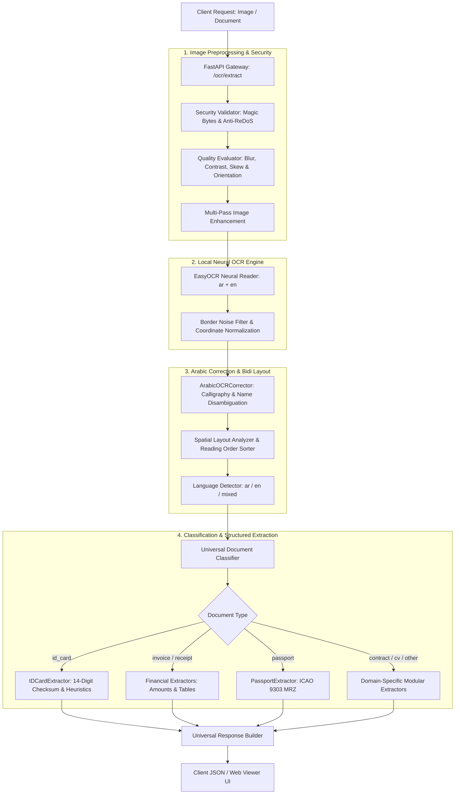

# 📄 Universal Document OCR & Intelligence Microservice

<div align="center">

[](https://www.python.org/)
[](https://fastapi.tiangolo.com/)
[-4B8BBE)](https://github.com/JaidedAI/EasyOCR)
[](https://docs.pytest.org/)
[](#-bidi-safe-spatial-layout-analysis)
[](LICENSE)

**An enterprise-grade, high-performance Document Intelligence and OCR Microservice built with FastAPI, EasyOCR, and a Bidirectional Spatial Layout Engine.**  
*Specialized in complex Arabic calligraphy, bidirectional mixed scripts, and zero-leakage offline processing.*

[Features](#-key-features) • [Architecture](#-system-architecture) • [Quick Start](#-quick-start) • [Interactive Viewer](#-interactive-web-viewer) • [API Reference](#-api-endpoints) • [Project Structure](#-project-structure)

</div>

---

## 🌟 Key Features

### 1. 🔒 100% Offline & Privacy-First
- Zero dependencies on external cloud APIs or third-party networks.
- All neural inference runs locally on the host device (CPU/GPU).
- Sensitive legal, national identity, and financial documents never leave your server perimeter.

### 2. 🧠 Intelligent Arabic OCR Post-Corrector (`ArabicOCRCorrector`)
- **Calligraphic Egyptian Header Resolution:** Custom contextual lookahead regex engine fixing severe EasyOCR calligraphy distortions (e.g. `جمهوزكنذف صنالج بينمنا` ➔ `جمهورية مصر العربية`).
- **Official Card Titles:** Normalization of fragmented tokens into canonical `بطاقة تحقيق الشخصية`.
- **Phonetic & Shape Ambiguity Resolution:** Fixes terminal character confusion (e.g. `محمل` ➔ `محمد`, `أحمل` ➔ `أحمد`, `خالل` ➔ `خالد`).
- **Composite Name Repair:** Reconstructs broken divine prefixes (e.g. `عبا الشفيع` ➔ `عبد الشفيع`).
- **Administrative Vocabulary:** Automatic correction and canonicalization of Egyptian governorates and municipality indicators.

### 3. 📐 Bidi-Safe Spatial Layout Engine (Unicode UBA Compliant)
- Eliminates string-reversal anti-patterns.
- Preserves natural Right-to-Left (RTL) reading order for Arabic text while correctly maintaining embedded Left-to-Right (LTR) numeric sequences and Latin identifiers.
- Automatic column detection, vertical line clustering, and reading order sequencing.

### 4. 🗂️ Universal Multi-Document Classification & Extraction
The microservice automatically classifies uploaded documents and routes them to specialized extraction pipelines:
- **🪪 Egyptian National ID Cards:** 14-digit mathematical checksum verification, birth date decoding, gender identification, governorate resolution, and multi-line name/address parsing.
- **🧾 Invoices & Receipts:** Merchant name, invoice numbers, line items, tax/VAT, and total amounts.
- **🛂 Passports:** ICAO 9303 Machine Readable Zone (MRZ) extraction and validation.
- **📜 Contracts & Legal Documents:** Parties identification, execution dates, and clause detection.
- **💼 Resumes & CVs:** Candidate contact details, education history, and skill sections.
- **🚗 Driver Licenses & Bank Documents:** Account numbers, IBANs, and issuance dates.

### 5. 🖥️ Interactive Modern Web Viewer (`/viewer`)
- Built-in, responsive dark-mode document laboratory accessible via `/viewer`.
- Side-by-side inspection tabs:
  - **Structured Fields:** Extracted entity cards with individual confidence scores and validation tags.
  - **Lines & Reading Order:** Visual inspection of bounding boxes and reading order tokens.
  - **Tables:** Structured tabular view of detected grid contents.
  - **Full Text:** Raw and layout-ordered document text.
  - **JSON Response:** Full syntax-highlighted API output.

---

## 🏗️ System Architecture



---

## 📁 Project Structure

```text
OCR-MODEL/
├── app/
│   ├── api/
│   │   ├── dependencies/             # Engine singleton caches & dependency injection
│   │   │   └── ocr.py
│   │   └── v1/
│   │       └── routers/
│   │           ├── ocr.py            # Primary OCR & extraction endpoints
│   │           └── viewer.py         # Modern Web Viewer GUI
│   ├── core/                         # Settings, exceptions, logging & middleware
│   │   ├── config.py
│   │   ├── exceptions.py
│   │   └── exception_handlers.py
│   ├── domain/                       # Core Pydantic data schemas & interfaces
│   │   ├── interfaces/
│   │   │   └── ocr_engine.py
│   │   └── schemas/
│   │       ├── core.py               # TextBlock, BoundingBox, OCRResult schemas
│   │       └── responses.py          # UniversalAPIResponse, StructuredField schemas
│   ├── infrastructure/               # Concrete OCR engine implementations
│   │   └── ocr/
│   │       └── easyocr_engine.py     # Local EasyOCR neural engine
│   ├── services/                     # Business logic and domain pipelines
│   │   ├── classification/           # Document type classifier
│   │   ├── extraction/               # Specialized modular extractors
│   │   │   ├── id_card.py            # Egyptian ID parser with checksum validation
│   │   │   ├── invoice.py            # Invoice & bill extractor
│   │   │   ├── receipt.py            # Thermal & point-of-sale receipt extractor
│   │   │   ├── passport.py           # Passport ICAO MRZ validator
│   │   │   ├── contract.py           # Legal contracts parser
│   │   │   ├── cv.py                 # Resume parser
│   │   │   ├── driver_license.py     # Driving license parser
│   │   │   ├── bank_document.py      # Bank statement extractor
│   │   │   ├── registry.py           # Extractor registry pattern
│   │   │   └── validation.py         # Mathematical checksums (ID, MRZ, dates)
│   │   ├── image_processing/         # Preprocessing, quality & geometry
│   │   │   ├── geometry.py
│   │   │   ├── loader.py
│   │   │   ├── preprocessor.py
│   │   │   ├── quality.py
│   │   │   └── validator.py
│   │   ├── language/                 # Script and language detection
│   │   │   └── language_detector.py
│   │   ├── layout/                   # Bidi formatting, spatial clustering & tables
│   │   │   ├── bidi_formatter.py
│   │   │   ├── layout_analyzer.py
│   │   │   └── reading_order.py
│   │   ├── ocr/                      # Multi-signal evaluation & fusion
│   │   │   └── evaluator.py
│   │   └── text_processing/          # Proprietary Arabic domain corrector
│   │       └── arabic_corrector.py   # Calligraphic header & name disambiguation
│   └── main.py                       # FastAPI application factory
├── tests/                            # Comprehensive test suite (97 tests)
│   ├── test_universal_system.py
│   ├── test_modular_extractors.py
│   ├── test_production_hardening.py
│   ├── test_text_ordering_bidi.py
│   ├── test_preprocessing_pipeline.py
│   ├── test_document_understanding.py
│   └── test_ocr_optimization.py
├── .env.example                      # Configuration template
├── requirements.txt                  # Python dependencies
└── README.md                         # Documentation
```

---

## ⚡ Quick Start

### 1. Prerequisites
- **Python 3.10, 3.11, or 3.12**
- **Git**

### 2. Clone and Setup Environment

```bash
# Clone the repository
git clone https://github.com/Zeyadmohamed291/OCR-MODEL.git
cd OCR-MODEL

# Create virtual environment
python -m venv venv

# Activate virtual environment
# Windows (PowerShell):
.\venv\Scripts\Activate.ps1
# Windows (CMD):
.\venv\Scripts\activate.bat
# Linux / macOS:
source venv/bin/activate

# Install required dependencies
pip install -r requirements.txt
```

### 3. Configure Settings

Copy `.env.example` to `.env`:

```bash
# Windows:
copy .env.example .env
# Linux / macOS:
cp .env.example .env
```

EasyOCR runs locally by default. Optional OCR settings and their defaults are
defined in `app/core/config.py`.

### 4. Launch the Server

```bash
python -m uvicorn app.main:app --host 127.0.0.1 --port 8000 --reload
```

- **Interactive Swagger Docs:** [http://127.0.0.1:8000/docs](http://127.0.0.1:8000/docs)
- **Web Document Viewer:** [http://127.0.0.1:8000/viewer](http://127.0.0.1:8000/viewer)
- **Health Check Endpoint:** [http://127.0.0.1:8000/health](http://127.0.0.1:8000/health)

---

## 🖥️ Interactive Web Viewer

Open your browser at `http://127.0.0.1:8000/viewer` to access the built-in testing interface.

Features include:
1. **Direct Drag-and-Drop:** Upload invoices, IDs, receipts, contracts, or screenshots.
2. **Visual Tabs:** Instantly switch between parsed structured fields, reading order blocks, extracted tables, full text, and raw JSON.
3. **Telemetry Dashboard:** Live display of inference time, average confidence, document classification, and script direction.

---

## 🔌 API Endpoints

### 1. Extract Document Intelligence
`POST /ocr/extract`

Processes an uploaded image file, applies image quality checks, executes OCR, performs bidirectional layout reconstruction, classifies the document, and extracts structured key-value entities.

**Request:**
- `Content-Type`: `multipart/form-data`
- `file`: Image file (`.jpg`, `.jpeg`, `.png`, `.webp`, `.bmp`)

**cURL Example:**
```bash
curl -X POST "http://127.0.0.1:8000/ocr/extract" \
     -H "accept: application/json" \
     -F "file=@sample_id.jpg"
```

**Response Example (Egyptian National ID):**
```json
{
  "success": true,
  "document_type": "id_card",
  "confidence": 0.85,
  "processing_time_ms": 1420.5,
  "fields": {
    "national_id": "29801011401234",
    "name": "أحمد محمد عبد الله محمود",
    "address": "15 شارع النصر المعادي القاهرة",
    "birth_date": "1998-01-01",
    "gender": "ذكر",
    "governorate": "القاهرة",
    "governorate_code": "01"
  },
  "structured_fields": [
    {
      "field_name": "national_id",
      "label": "National ID",
      "value": "29801011401234",
      "confidence": 0.98,
      "is_valid": true,
      "validation_note": "Valid Egyptian National ID"
    },
    {
      "field_name": "name",
      "label": "Name",
      "value": "أحمد محمد عبد الله محمود",
      "confidence": 0.94,
      "is_valid": true
    },
    {
      "field_name": "address",
      "label": "Address",
      "value": "15 شارع النصر المعادي القاهرة",
      "confidence": 0.91,
      "is_valid": true
    }
  ],
  "layout": {
    "reading_order": "rtl",
    "lines": [
      { "line_number": 1, "text": "جمهورية مصر العربية", "direction": "rtl" },
      { "line_number": 2, "text": "بطاقة تحقيق الشخصية", "direction": "rtl" },
      { "line_number": 3, "text": "أحمد", "direction": "rtl" },
      { "line_number": 4, "text": "محمد عبد الله محمود", "direction": "rtl" },
      { "line_number": 5, "text": "١٥ شارع النصر المعادي", "direction": "auto" },
      { "line_number": 6, "text": "محافظة القاهرة", "direction": "rtl" }
    ]
  },
  "ocr": {
    "engine": "easy",
    "confidence": 0.85
  },
  "quality": {
    "is_blurry": false,
    "blur_score": 440.6,
    "resolution_ok": true
  }
}
```

---

### 2. Health & Readiness Check
`GET /health`

Returns service status and indicates whether EasyOCR neural models are pre-loaded into memory.

**Response:**
```json
{
  "status": "ok",
  "engine_ready": true,
  "version": "1.0.0"
}
```

---

## 🧪 Testing & Validation

The project includes an extensive test suite covering all modules:

```bash
# Run the complete test suite
python -m pytest tests/ -v
```

### Test Suite Breakdown:
- **`test_universal_system.py`**: End-to-end classification and extraction across all supported document types.
- **`test_modular_extractors.py`**: Unit tests for modular extractor schemas, isolated confidences, and validation logic.
- **`test_production_hardening.py`**: 24 edge-case scenarios (perspective distortion, low contrast, blur, magic-byte spoofing, anti-ReDoS security).
- **`test_text_ordering_bidi.py`**: Unicode Bidirectional Algorithm (UBA) compliance, multi-digit ID preservation, and mixed-direction layout.
- **`test_preprocessing_pipeline.py`**: Image quality assessment, auto-rotation, and deskew algorithms.
- **`test_ocr_optimization.py`**: EasyOCR rich inference, multi-pass merging, and script detection.

**Status:** `97 passed in ~18s (100% Success Rate)`

---

## 📄 License

Distributed under the **MIT License**. See `LICENSE` for more information.
