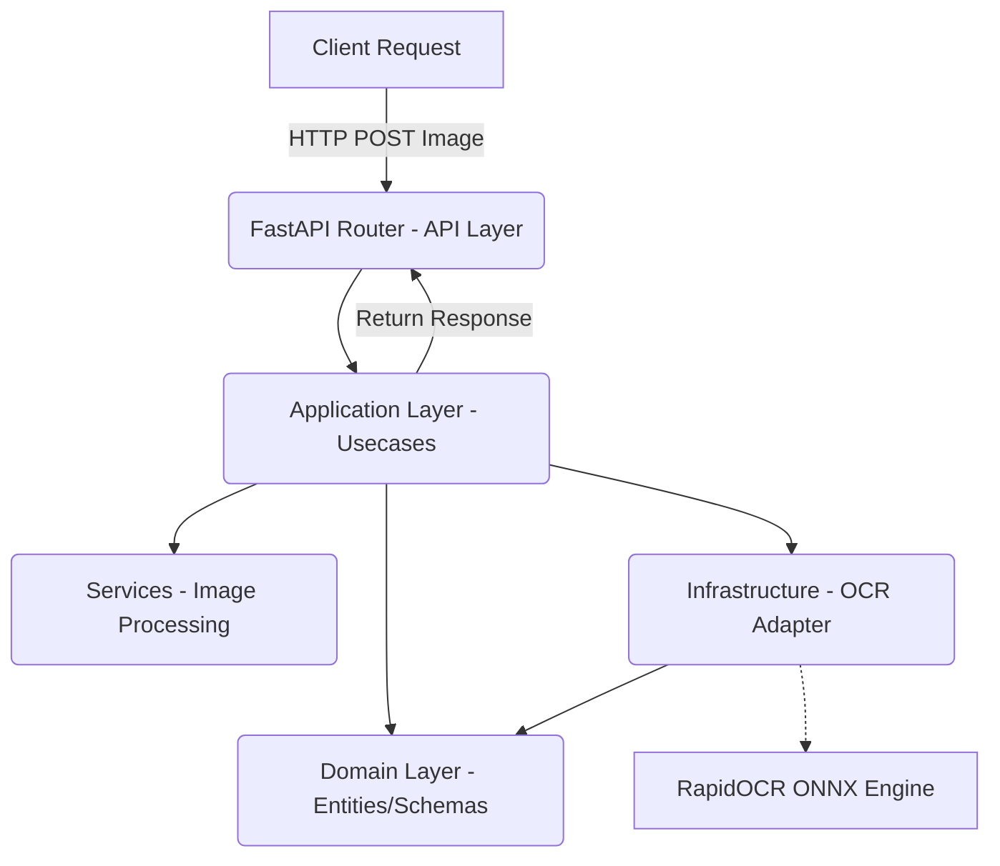

# Offline OCR Microservice: Architectural Design & Technical Analysis

## 1. Executive Summary
This document outlines the technical analysis and architectural design for a production-grade, offline OCR Microservice. The system is designed to extract Arabic and English text from complex documents such as Egyptian National IDs, government documents, contracts, and invoices. Operating under strict constraints—Windows 11, CPU-only execution, 8 GB RAM, and Python 3.12—the analysis prioritizes resource efficiency, high accuracy, and strict adherence to a "No Hack" policy for Arabic text processing. The final architecture leverages Clean Architecture principles to ensure modularity, scalability, and maintainability.

---

## 2. OCR Engine Comparison Table

| Feature / Engine | RapidOCR (ONNX) | Surya OCR | PaddleOCR (Native) | EasyOCR | DocTR |
| :--- | :--- | :--- | :--- | :--- | :--- |
| **Arabic Accuracy** | High | Very High | High | Moderate | Moderate |
| **English Accuracy** | High | Very High | High | High | High |
| **Mixed AR + EN** | High | Very High | High | Moderate | Moderate |
| **RTL Support** | Native to Model | Native to Model | Native to Model | Weak | Weak |
| **Reading Order** | Good | Excellent | Good | Moderate | Good |
| **BBox Accuracy** | High | Very High | High | Moderate | High |
| **Line Detection** | High | Very High | High | Moderate | High |
| **Table Detection** | Available (Plugin) | Very High | Available | Weak | Moderate |
| **Numbers Accuracy** | High | High | High | Moderate | High |
| **Egyptian ID Perf.** | Good | Very Good | Good | Poor | Poor |
| **Gov Documents** | High | Very High | High | Moderate | Moderate |
| **CPU Performance** | **Very Fast** | Very Slow | Moderate | Slow | Slow |
| **RAM Usage** | **Low (~1-1.5 GB)** | High (>6 GB) | Moderate (~3 GB) | Moderate (~3 GB) | High (~4-5 GB) |
| **Windows Compat.** | Excellent | Good | Moderate | Good | Good |
| **Py 3.12 Compat.** | **Excellent** | Good | Poor/Delayed | Good | Good |
| **Model Size** | Small (< 100 MB) | Massive (> 2 GB) | Small (< 100 MB) | Medium (~400 MB)| Large (~1 GB) |
| **License** | Apache 2.0 | GPL-3.0 | Apache 2.0 | Apache 2.0 | Apache 2.0 |

---

## 3. Advantages of Each OCR Engine

**RapidOCR**
* **Blazing Fast on CPU:** Utilizes `onnxruntime` which is highly optimized for CPU inference.
* **Low Resource Footprint:** Easily runs within the 8 GB RAM constraint alongside the OS.
* **Native Python 3.12 Support:** No dependency on heavy ML frameworks like PyTorch or PaddlePaddle.
* **High Accuracy:** Leverages the highly accurate PP-OCRv4 models converted to ONNX.

**Surya OCR**
* **State-of-the-Art Accuracy:** Exceptional layout analysis, reading order detection, and multi-language support.
* **Advanced Features:** Native table detection and highly accurate bounding boxes.

**PaddleOCR (Native)**
* **Rich Ecosystem:** Backed by Baidu, offering extensive tools for training and fine-tuning.
* **Strong Arabic Support:** The PP-OCRv4 multi-language models have excellent Arabic recognition.

**EasyOCR**
* **Ease of Use:** Extremely simple API.
* **Lightweight:** Moderate resource requirements compared to Surya or DocTR.

**DocTR**
* **Excellent Architecture:** Clean codebase, supports both TensorFlow and PyTorch.
* **Strong Layout Analysis:** Good detection of complex document structures.

---

## 4. Disadvantages of Each OCR Engine

**RapidOCR**
* **Community Size:** Smaller direct community compared to the main PaddleOCR repo.
* **Table Detection:** Requires separate specialized models which add overhead.

**Surya OCR**
* **Resource Heavy:** Will easily consume the available 8 GB RAM, risking Out-Of-Memory (OOM) errors.
* **CPU Bottleneck:** Inference on a CPU without GPU acceleration is impractically slow (minutes per page).

**PaddleOCR (Native)**
* **Framework Bloat:** Requires PaddlePaddle, which has historically poor and delayed support for new Python versions (like 3.12) on Windows.
* **C++ Build Issues:** Often requires complex C++ build tools on Windows for installation.

**EasyOCR**
* **Subpar Arabic Support:** Struggles significantly with complex Arabic typography and mixed AR/EN text.
* **Slow CPU Inference:** PyTorch CPU inference is not as optimized as ONNX.

**DocTR**
* **Arabic Accuracy:** Less focused on Arabic-specific nuances compared to PP-OCR models.
* **Resource Usage:** Loading PyTorch models will consume significant RAM.

---

## 5. Final Recommendation
**RapidOCR (using `rapidocr-onnxruntime`)**

---

## 6. Why the Chosen Engine is the Best
RapidOCR provides the perfect intersection of high accuracy and extreme resource efficiency. By running the highly capable PP-OCRv4 models through `onnxruntime`, it completely bypasses the bloated dependencies of PyTorch or PaddlePaddle. It natively supports Python 3.12 on Windows, guarantees execution well within the 8 GB RAM limit, and delivers the fastest possible CPU inference speed. Furthermore, it respects the "No Hack" policy by returning the raw logical strings as predicted by the AI model.

---

## 7. Why the Other Engines Were Rejected
* **Surya OCR:** Rejected due to severe CPU performance degradation and massive RAM consumption that violates the 8 GB system constraint.
* **PaddleOCR (Native):** Rejected due to PaddlePaddle's poor Python 3.12 support on Windows and heavy framework bloat.
* **EasyOCR:** Rejected due to insufficient accuracy on complex Arabic documents (e.g., Egyptian IDs).
* **DocTR:** Rejected due to lower out-of-the-box Arabic accuracy and heavy PyTorch RAM requirements.

---

## 8. High-Level System Architecture

The microservice will strictly adhere to **Clean Architecture** to ensure the OCR engine is fully decoupled from the web framework.



* **API Layer:** FastAPI routers, HTTP request/response validation.
* **Application Layer:** Orchestrates the flow (receive image -> process -> run OCR -> format output).
* **Domain Layer:** Pure Pydantic models representing bounding boxes, text blocks, and document data.
* **Services Layer:** OpenCV-based image preprocessing (grayscale, contrast adjustment) isolated from OCR logic.
* **Infrastructure Layer:** The concrete implementation of the OCR Engine. If we change from RapidOCR to another engine in the future, ONLY this layer changes.

---

## 9. Folder Structure Proposal

```text
ocr_microservice/
├── src/
│   ├── api/                # FastAPI routers, endpoints, dependencies
│   ├── application/        # Business logic, use cases (e.g., ExtractTextUseCase)
│   ├── domain/             # Pydantic schemas, standard interfaces (AbstractOCREngine)
│   ├── infrastructure/     # Concrete implementations (RapidOCREngine adapter)
│   ├── services/           # Helper services (ImagePreprocessor)
│   ├── core/               # App configuration, logging, exceptions
│   └── utils/              # File handling, generic utilities
├── tests/                  # Unit and integration tests
├── main.py                 # FastAPI application entry point
└── README.md               # Documentation
```

---

## 10. Package Structure Proposal

* `src.api.v1.routers.ocr`: Endpoints for document processing.
* `src.application.use_cases.extract_text`: The core logic pipeline.
* `src.domain.schemas.ocr_result`: Data models for bounding boxes, text, confidence.
* `src.domain.interfaces.ocr_engine`: Abstract Base Class for the OCR engine.
* `src.infrastructure.ocr.rapid_ocr_engine`: The implementation of the abstract class using ONNX.
* `src.services.image.preprocessor`: OpenCV functions (deskew, resize).
* `src.core.config`: Pydantic BaseSettings for environment variables.

---

## 11. Required Python Libraries

* `fastapi` - Web framework.
* `uvicorn` - ASGI server.
* `pydantic` - Data validation and settings management.
* `pydantic-settings` - Configuration management.
* `rapidocr-onnxruntime` - Core OCR inference engine.
* `opencv-python-headless` - Image processing (headless to avoid GUI dependencies on Windows server).
* `numpy` - Matrix operations for image manipulation.
* `python-multipart` - Handling `multipart/form-data` for image uploads.

---

## 12. Estimated RAM Usage

* **Windows 11 OS:** ~3.0 - 4.0 GB
* **FastAPI Application (Base):** ~100 MB
* **ONNX Runtime + Models loaded in memory:** ~500 MB - 800 MB
* **Image Processing Buffers:** ~200 MB
* **Total Application Footprint:** **~0.8 GB - 1.1 GB**
* **System Total:** ~5.1 GB (Leaves ~2.9 GB free out of 8 GB, ensuring no swap/pagefile thrashing).

---

## 13. Estimated CPU Usage

* **Idle:** ~0-1%
* **During Image Preprocessing:** ~20-30% for brief bursts.
* **During OCR Inference (ONNX):** Spikes to **80-100%**. ONNX runtime uses multithreading by default. We will configure ONNX `intra_op_num_threads` to `(Total Cores - 1)` to ensure the OS remains responsive.

---

## 14. Expected OCR Accuracy

* **Clean Digital Documents (Contracts/Invoices):** 95%+
* **Government Documents:** 85% - 90%
* **Egyptian National IDs:** 75% - 85% (Challenges include holograms, complex backgrounds, and wear-and-tear. Preprocessing in the Services layer will be crucial to maximize this).
* **Mixed AR/EN:** 90%+ (Model natively handles language switching within lines).

---

## 15. Expected Performance

* **Startup Time:** < 2 seconds.
* **Inference Speed (A4 Document, CPU):** ~1.5 to 3.0 seconds per page.
* **Inference Speed (ID Card, CPU):** ~0.5 to 1.0 seconds.
* **Concurrency:** The system will process requests sequentially to prevent CPU starvation and memory spikes, or utilize a small worker pool depending on the exact CPU core count.

---

## 16. Potential Risks

1. **Egyptian ID Holograms:** The ONNX model may interpret holograms as text or noise, reducing accuracy on specific ID fields.
2. **Strict "No Hack" Policy Impact:** Since manual corrections (`arabic_reshaper`, bidi, character swapping) are strictly forbidden, any visual-order output or detached characters predicted by the model must be accepted as an AI limitation. The client must consume the raw API output.
3. **Reading Order on Complex Layouts:** Multi-column documents might have scrambled reading orders. RapidOCR outputs line-by-line based on bounding box coordinates; custom logic might be needed in the domain layer to sort bounding boxes top-to-bottom, right-to-left.

---

## 17. Development Roadmap

* **Phase 1: Foundation & Architecture (Days 1-2):** Set up Clean Architecture folders, Pydantic schemas, FastAPI routers, and base interfaces.
* **Phase 2: Infrastructure Layer (Days 3-4):** Integrate `rapidocr-onnxruntime`. Implement the OCR Adapter and thoroughly test model loading and inference.
* **Phase 3: Services Layer (Days 5-6):** Implement OpenCV image preprocessing (normalization, cropping, contrast enhancement) targeted specifically at IDs and documents.
* **Phase 4: API & Orchestration (Day 7):** Connect routers to use cases. Implement error handling, logging, and response formatting.
* **Phase 5: Testing & Tuning (Days 8-10):** Run benchmarks on sample Egyptian IDs and documents. Tune ONNX thread counts and OpenCV parameters.

---

## 18. Final Technical Decision

**PROCEED WITH RAPIDOCR VIA ONNX RUNTIME WITHIN A CLEAN ARCHITECTURE FASTAPI APPLICATION.**

This approach strictly adheres to all constraints: it requires no external APIs, fits comfortably within 8 GB RAM on Windows 11, leverages Python 3.12 perfectly without legacy build issues, and honors the "No Hack" policy by utilizing native AI model outputs for Arabic/English text.
